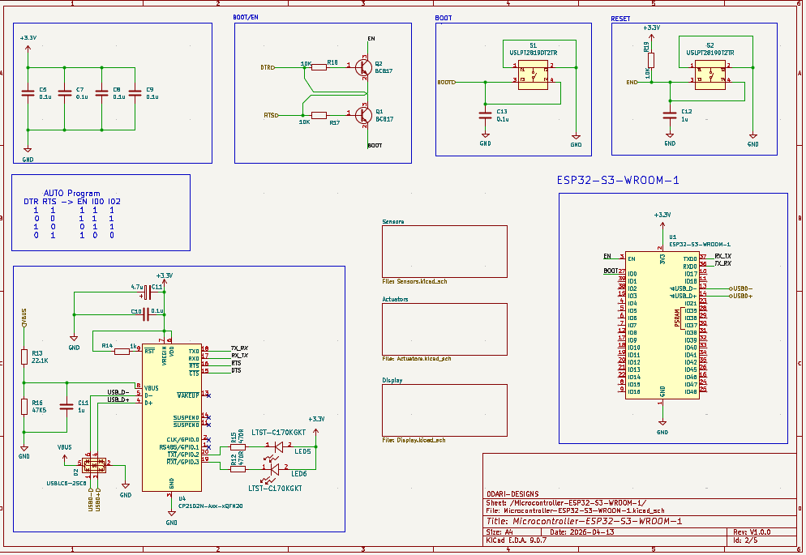

# IoT Device PCB

An IoT device PCB designed for logging and transmitting data.

## Schematic

## Specifications

- **Version:** V1.0.0
- **Date:** 2026-04-27
- **Company:** ODARI-DESIGNS

## Key Components

- **U1:** MCP73871 - Li-Ion/Li-Po Battery Charge Management Controller
- **J1:** USB Type-C Receptacle (USB 2.0, 16-pin)
- **J:** JST B2B-PH-K-S Connector (2-pin battery connection)
- **LEDs:** Status indicators (LTST-C170KRKT)

## Features

- USB-C power input
- Battery charging circuit (single-cell Li-Ion/Li-Po)
- LED status indicators
- Compact design for IoT applications

## License

MIT
